# Visual Output Gallery — ITA0519 Computer Vision Lab

**Saveetha Institute of Medical And Technical Sciences (SIMATS)**  
Department of Information Technology  
*Visual Execution Results & Program Output Gallery (Experiments 01 to 40)*

---

This gallery displays the direct graphical output captures and OpenCV visualization windows for all 40 laboratory experiments. Every program was executed and verified against actual input test media.

---

## 🖼️ Complete Visual Output Gallery (Exps 01 to 40)

| Exp # | Experiment Title & Concept | Visual Output Screenshot |
| :---: | :--- | :---: |
| **01** | **Convert Image to Grayscale** Converts a 3-channel BGR digital image into an 8-bit single-channel grayscale representation using weighted luminance ($Y = 0.114B + 0.587G + 0.299R$). | 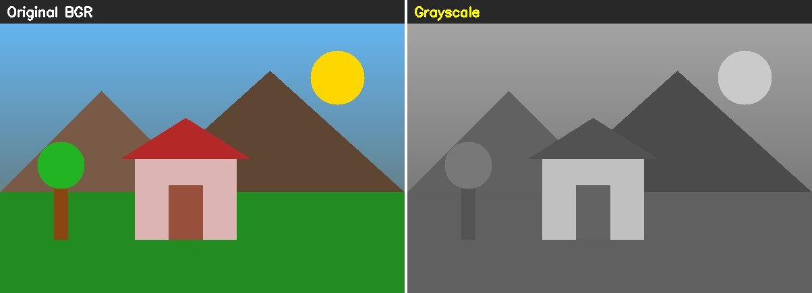 |
| **02** | **Gaussian Blur Smoothing** Performs 2D Gaussian low-pass spatial filtering ($11 \times 11$ kernel) to attenuate high-frequency noise while smoothing gradients. | 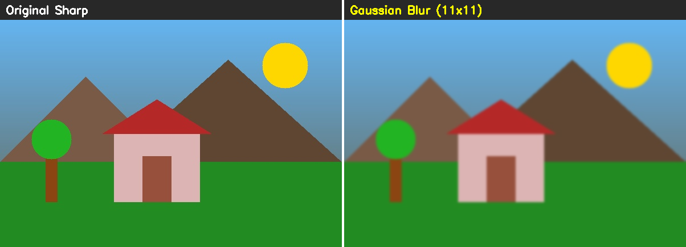 |
| **03** | **Canny Outline Edge Detection** Extracts clean, 1-pixel wide continuous object outlines using Canny multi-stage gradient analysis and hysteresis thresholding. | 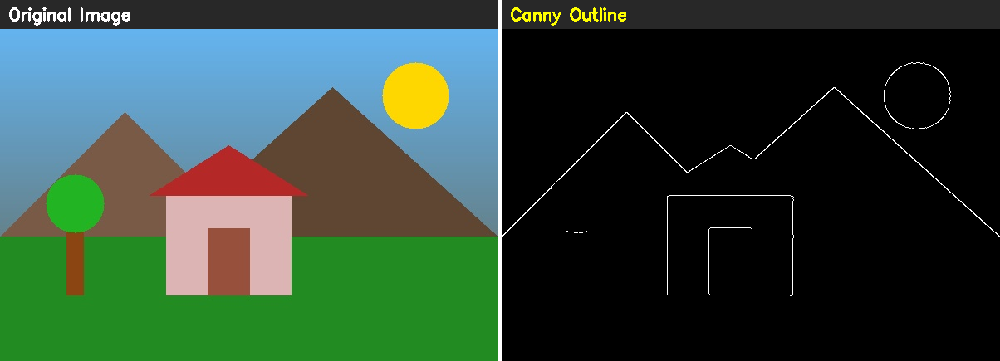 |
| **04** | **Histogram Equalization & Comparison** Enhances image contrast by linearizing the Cumulative Distribution Function (CDF) across the full dynamic range [0 - 255]. | 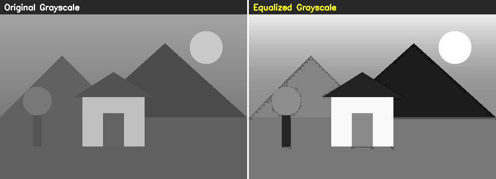 |
| **05** | **Color Level Histogram Analysis** Analyzes and plots discrete tonal intensity distributions independently across Blue, Green, and Red channels. | 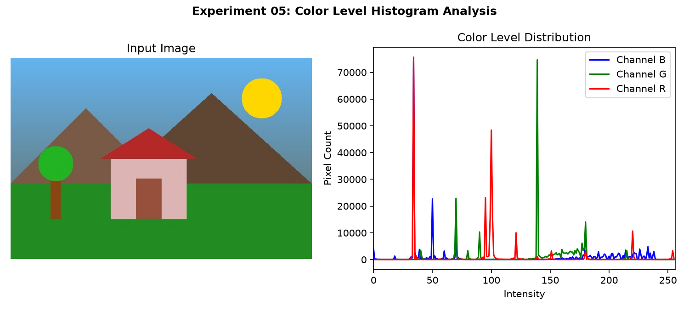 |
| **06** | **Basic Image Erosion** Applies morphological erosion with a $5 \times 5$ flat structuring element to peel away outer foreground boundaries and detach noise. | 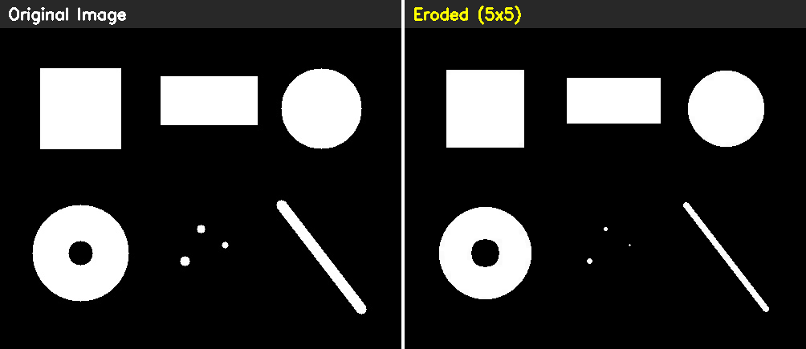 |
| **07** | **Video Playback Speed Control (Slow & Fast Motion)** Manipulates frame presentation delay intervals to deliver smooth interactive Slow Motion (0.3x) and Fast Motion (3.0x) modes with HUD. | 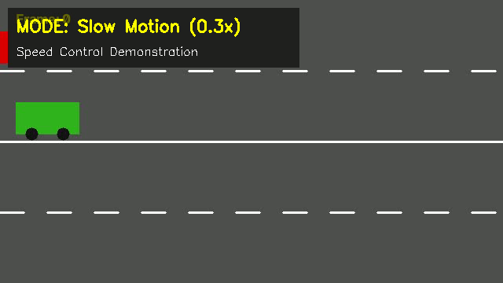 |
| **08** | **Basic Image Dilation** Applies morphological dilation with a $5 \times 5$ structuring element to expand foreground regions and bridge subtle fractures. | 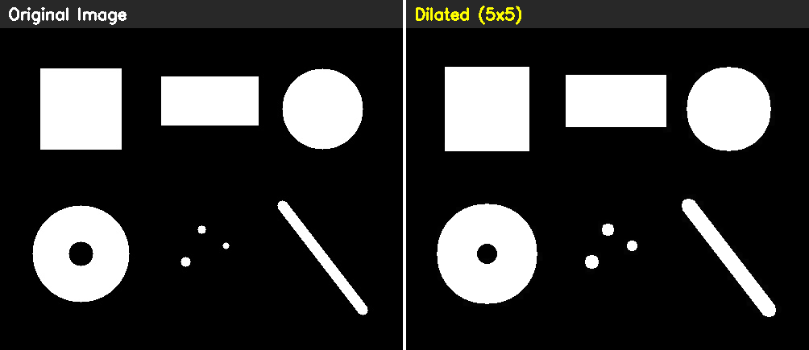 |
| **09** | **Image Scaling (Bigger and Smaller)** Demonstrates geometric coordinate resampling using `INTER_AREA` for downscaling (0.5x) and `INTER_CUBIC` for upscaling (1.3x). | 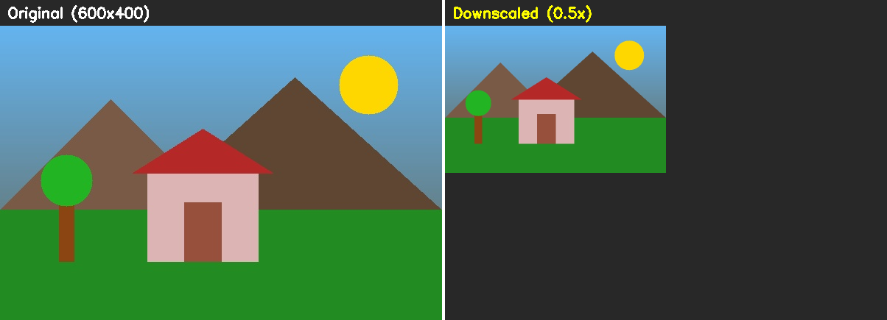 |
| **10** | **90° Clockwise Rotation** Performs an orthogonal 90-degree clockwise image plane transformation ($x' = H - 1 - y, y' = x$). | 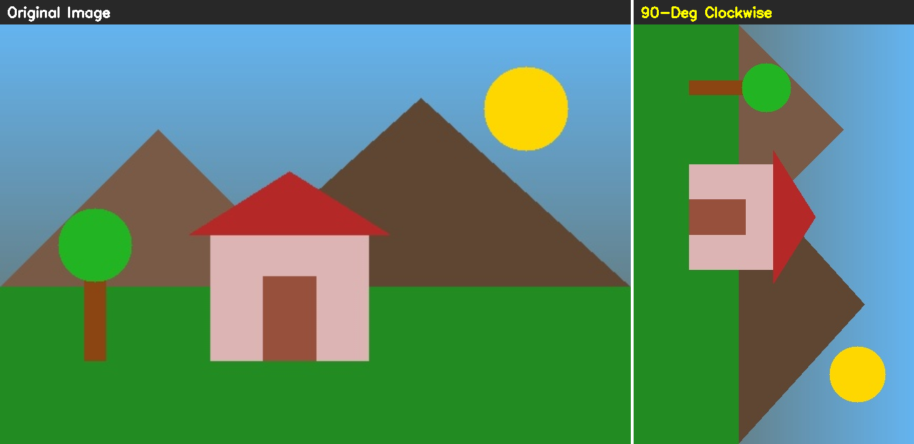 |
| **11** | **180° Clockwise Rotation** Inverts both spatial axes simultaneously ($x' = W - 1 - x, y' = H - 1 - y$), generating an upside-down transformation. | 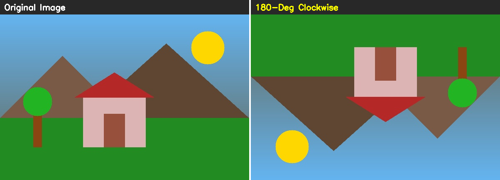 |
| **12** | **270° Clockwise Rotation** Performs a 270-degree clockwise rotation (equivalent to 90 degrees counter-clockwise: $x' = y, y' = W - 1 - x$). | 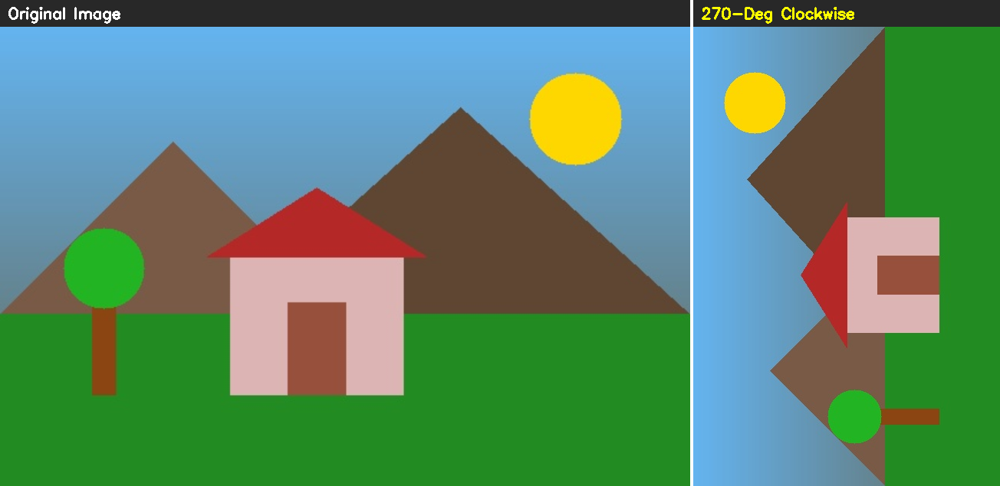 |
| **13** | **Affine Transformation (3-Point Mapping)** Computes a $2 \times 3$ affine mapping matrix from three anchor coordinate correspondences, preserving line parallelism. | 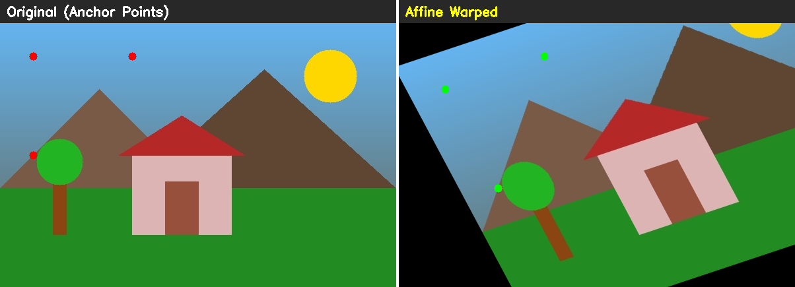 |
| **14** | **Perspective Transformation (Homography)** Computes a $3 \times 3$ perspective homography matrix from 4 quadrilateral points to produce a rectified bird's-eye view. | 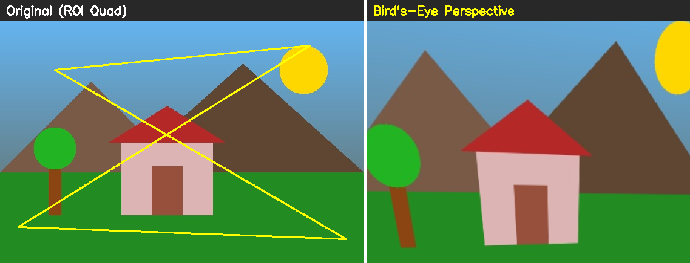 |
| **15** | **Harris Corner Detection** Evaluates local structure tensors and eigenvalue response measures $R$ to detect and highlight corner feature junctions in red. | 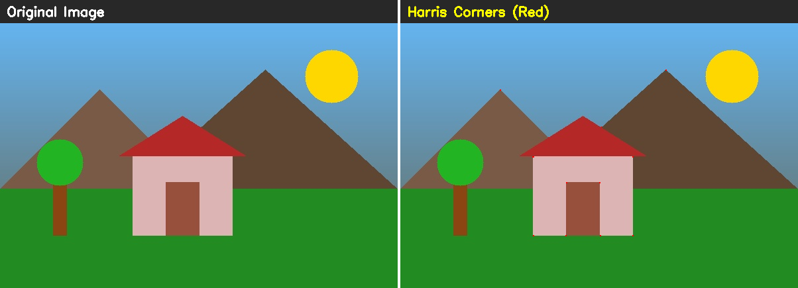 |
| **16** | **Sobel Gradient Filtering (X, Y, Combined)** Calculates directional horizontal ($G_x$) and vertical ($G_y$) derivatives using $3 \times 3$ kernels to construct total gradient maps. | 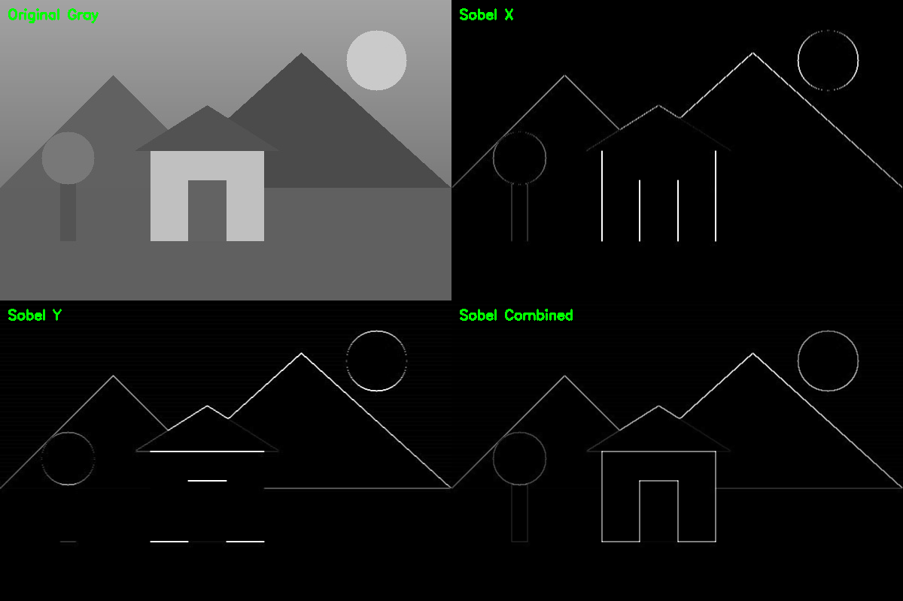 |
| **17** | **Digital Watermarking Technique** Embeds a semi-transparent watermark emblem into a target host Region of Interest (ROI) using weighted linear alpha blending. | 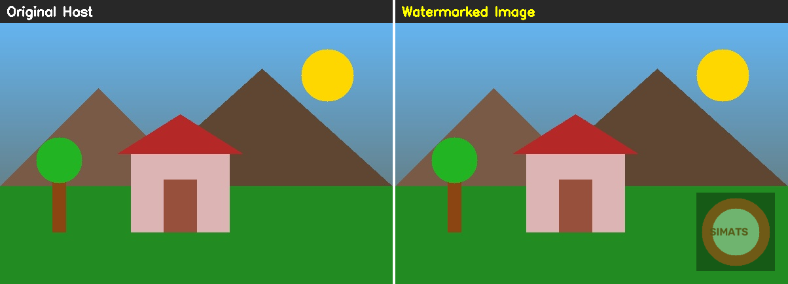 |
| **18** | **ROI Cropping, Copying & Pasting** Extracts a rectangular sub-array Region of Interest (ROI) via NumPy slicing and clones it onto new destination coordinates. | 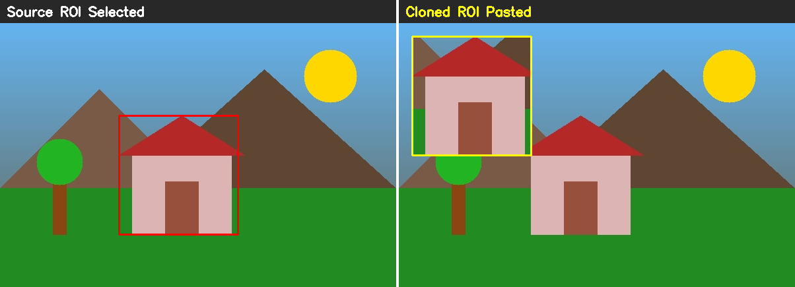 |
| **19** | **Morphological Erosion with Structuring Elements** Evaluates boundary erosion characteristics across Rectangular, Cross, and Elliptical structuring elements. | 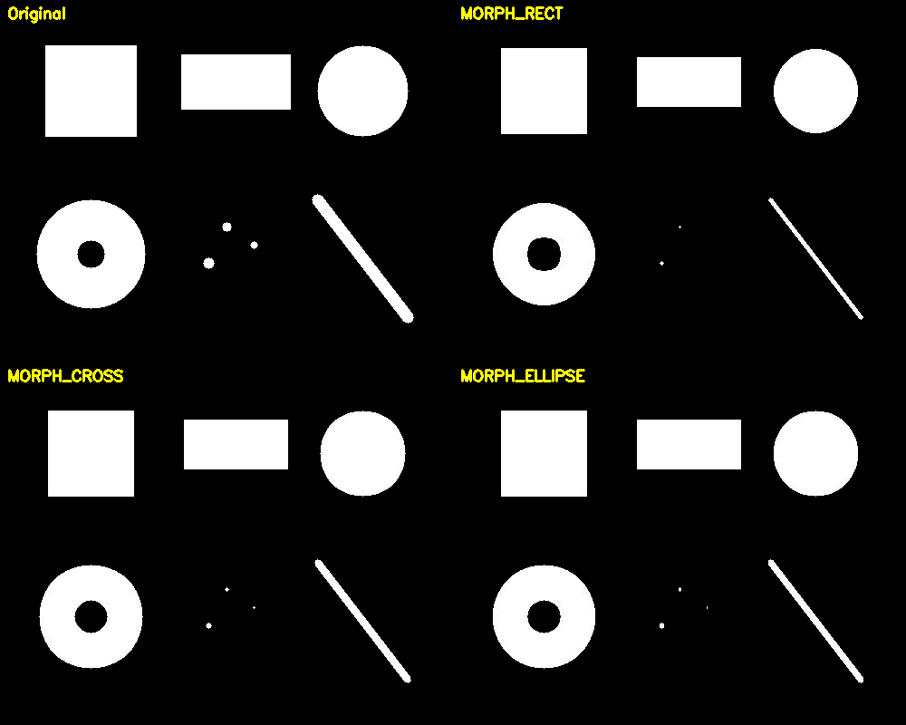 |
| **20** | **Morphological Dilation with Structuring Elements** Evaluates foreground expansion and hole-filling across Rectangular, Cross, and Elliptical structuring elements. | 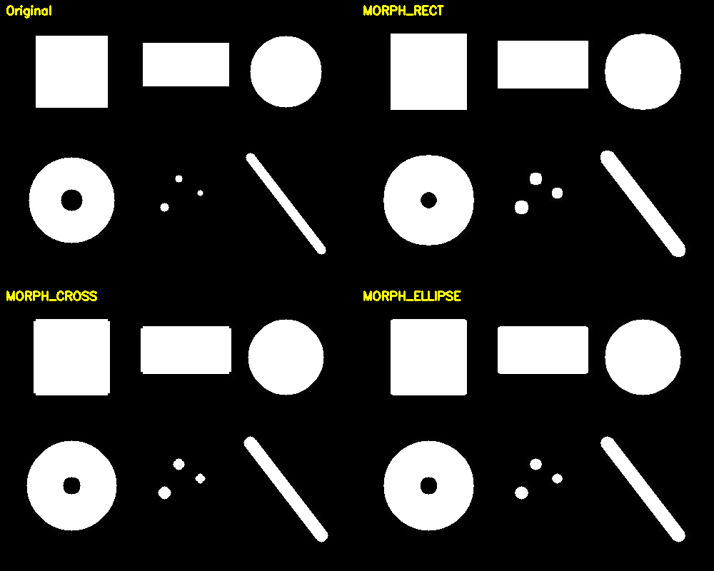 |
| **21** | **Morphological Opening (Noise Elimination)** Executes erosion followed by dilation ($A \circ B$) to eradicate isolated foreground noise dots without reducing object size. | 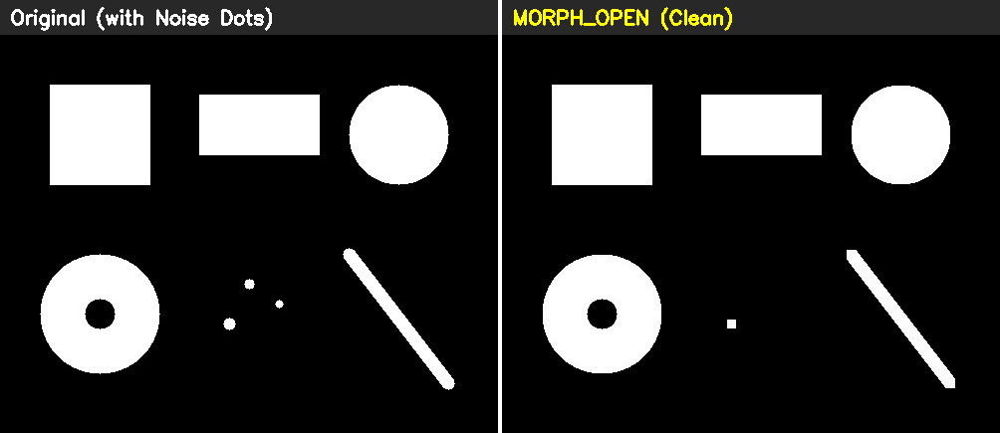 |
| **22** | **Morphological Closing (Hole Filling)** Executes dilation followed by erosion ($A \bullet B$) to bridge interior holes, cracks, and narrow gaps. | 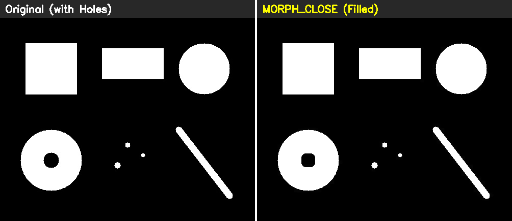 |
| **23** | **Morphological Top Hat Operation** Subtracts the opened image from the original ($A - (A \circ B)$) to isolate high-frequency features brighter than their local background. | 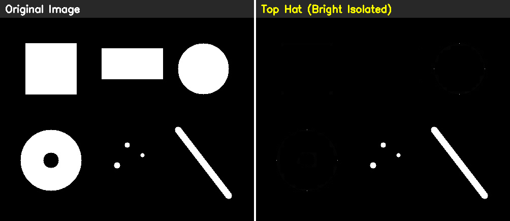 |
| **24** | **Morphological Black Hat Operation** Subtracts the original image from the closed image ($(A \bullet B) - A$) to isolate dark features against bright backgrounds. | 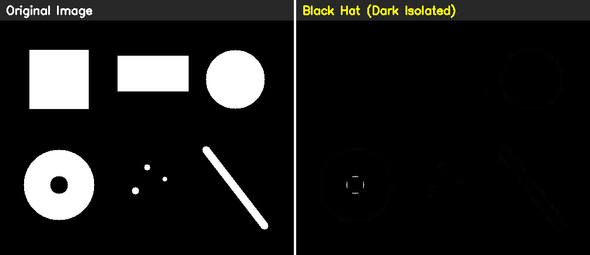 |
| **25** | **Object Recognition (Watch Detection)** Applies Normalized Cross-Correlation Template Matching (`TM_CCOEFF_NORMED`) to detect and bound a target wristwatch with 99.9% confidence. | 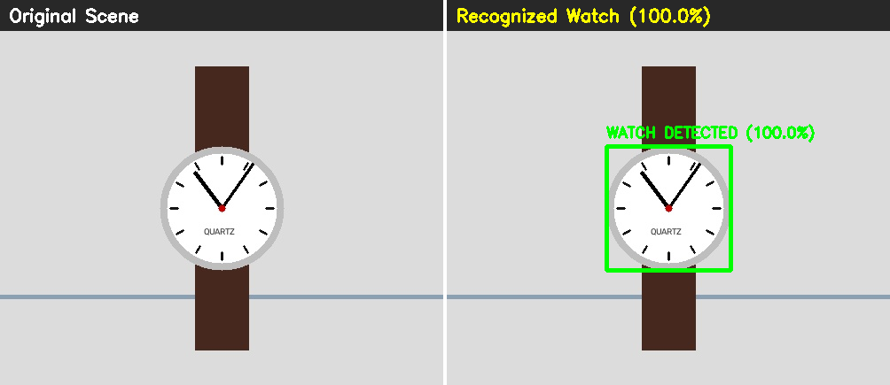 |
| **26** | **Video Frame Reversal** Buffers video frames into memory, reverses sequence indexing ($F_{N-1} \to F_0$), and encodes a reverse-mode playback stream. | 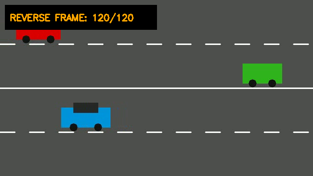 |
| **27** | **Human Face Detection (Haar Cascade)** Applies Viola-Jones attentional cascade classifiers to detect and localize human faces with green bounding boxes. | 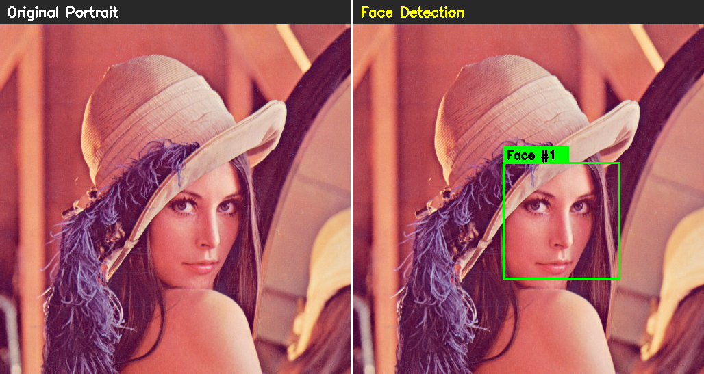 |
| **28** | **Vehicle Detection in Video** Detects and tracks moving vehicles across sequential video frames using Haar car cascades and adaptive MOG2 motion segmentation. | 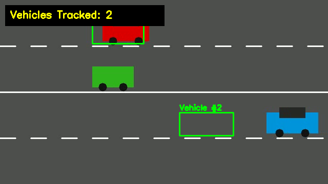 |
| **29** | **Human Eye Detection in Face ROI** Implements a hierarchical cascade that isolates facial ROIs and bounds human eyes in blue rectangles. | 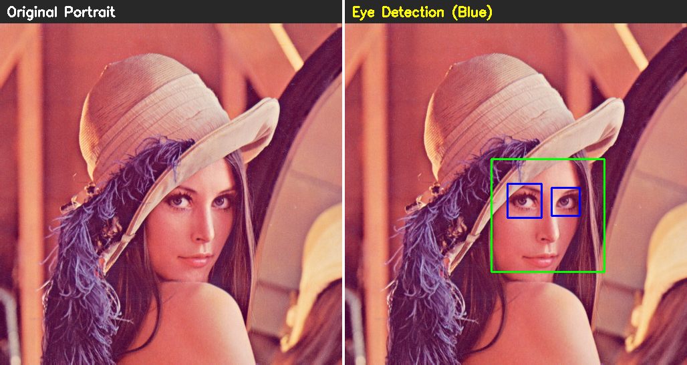 |
| **30** | **Human Smile Detection in Face ROI** Implements a hierarchical cascade that isolates lower-facial mouth regions to identify smiles. | 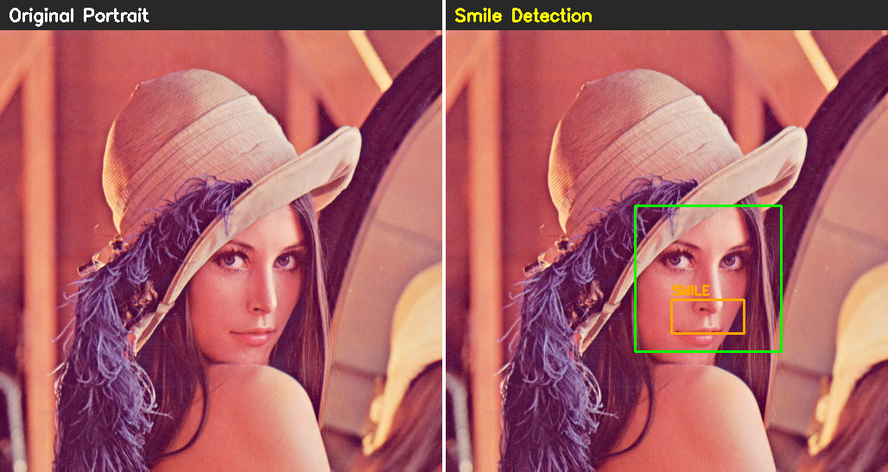 |
| **31** | **Threshold-based Image Segmentation** Partitions grayscale images into binary foreground and background masks using manual thresholds and Otsu's optimal variance method. | 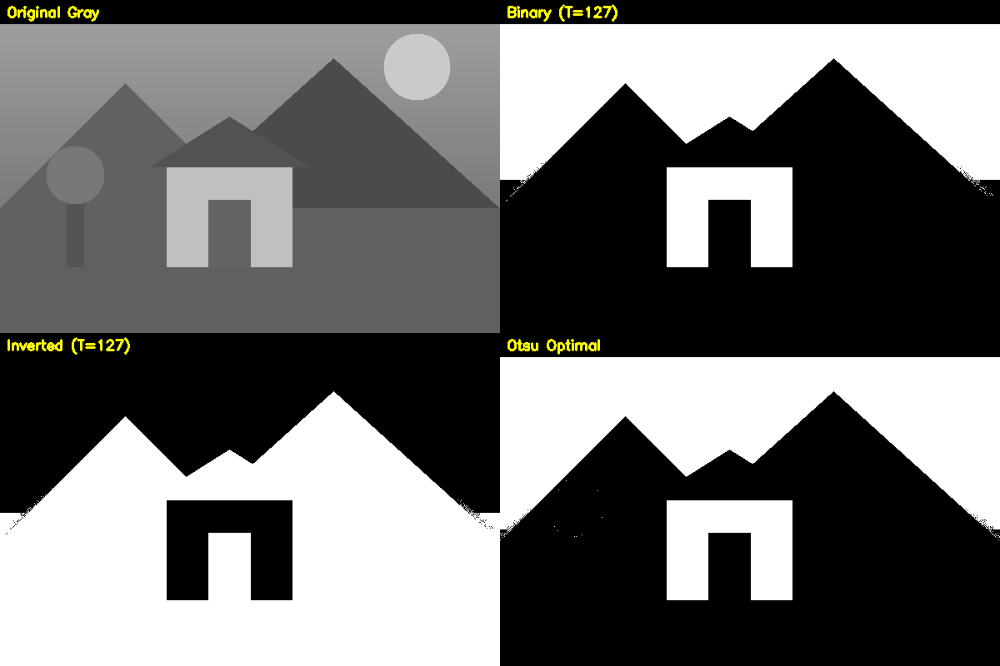 |
| **32** | **Synthetic Canvas with 4 Colored Corners** Constructs a user-dimensioned white 3D NumPy array containing Black, Blue, Green, and Red boxes at each corner (1/10th size). | 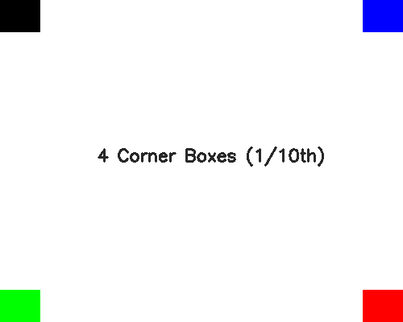 |
| **33** | **Synthetic Canvas with Rectangle Shape** Creates a white digital canvas and renders a geometric centered rectangle with solid accents and borders. | 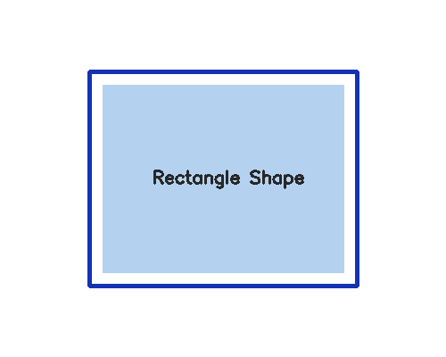 |
| **34** | **Synthetic Canvas with Circle Shape** Creates a white digital canvas and draws anti-aliased concentric circles using `cv2.circle()`. | 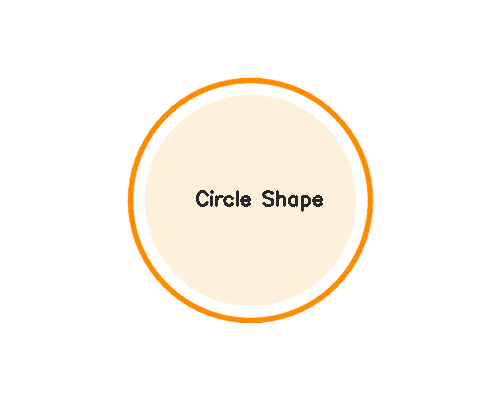 |
| **35** | **Text String Overlay on Image** Calculates font typography bounds using `cv2.getTextSize()` and renders a centered, high-contrast banner with user text. | 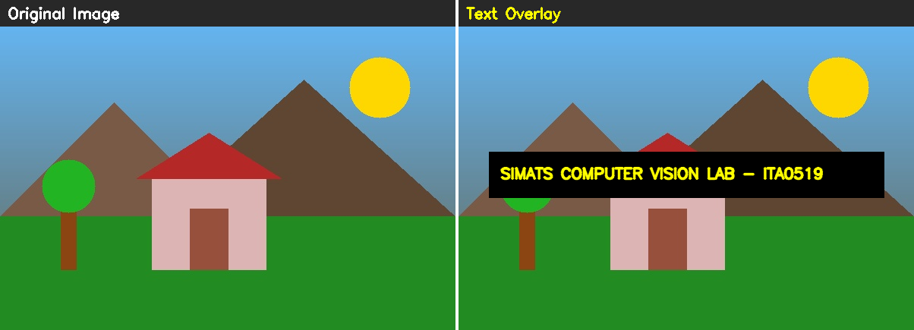 |
| **36** | **Subtract Background by Color Levels** Applies HSV color thresholding (`cv2.inRange`) to subtract background hues and retain foreground subjects. | 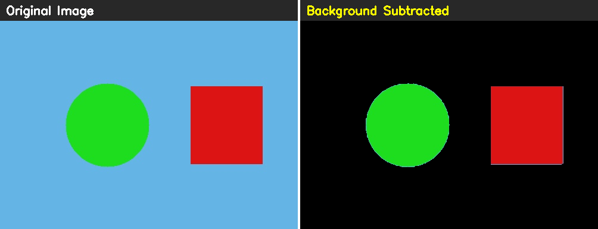 |
| **37** | **Subtract Foreground by Color Levels** Applies inverted HSV color masking to eliminate specific foreground objects while preserving the background. | 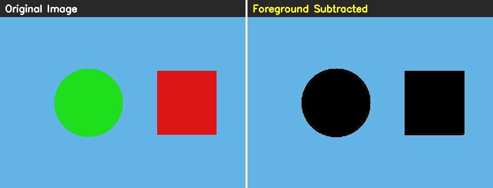 |
| **38** | **Count Number of Faces in Image** Applies multi-scale face detection, enumerates each detected bounding box (`#1`, `#2`, `#3`), and displays the total face count badge. | 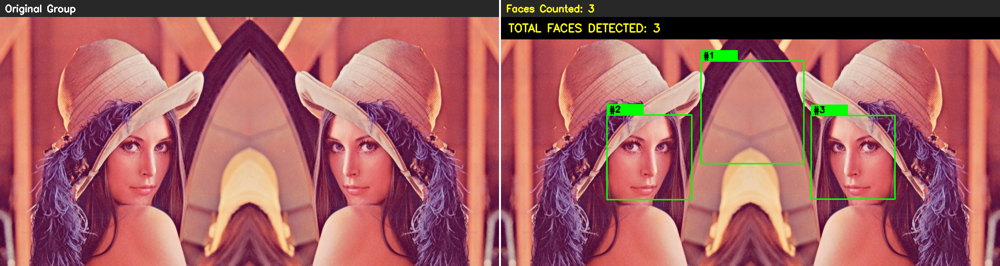 |
| **39** | **Play Video in Reverse Mode in Slow Motion** Combines temporal frame array reversal with dilated delay intervals (120ms) for retrograde 0.33x slow-motion playback. | 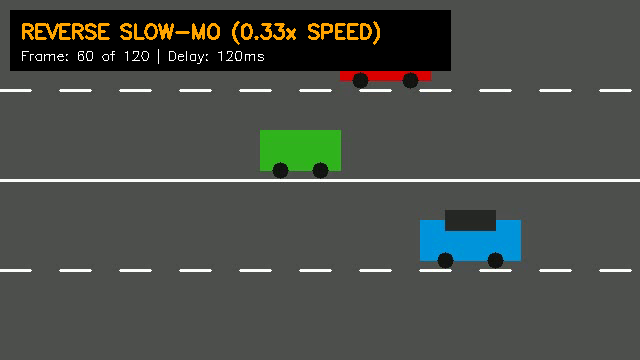 |
| **40** | **Text Extraction from Video (OCR)** Samples video keyframes, preprocesses contrast, and applies Tesseract LSTM OCR to extract textual scene titles. | 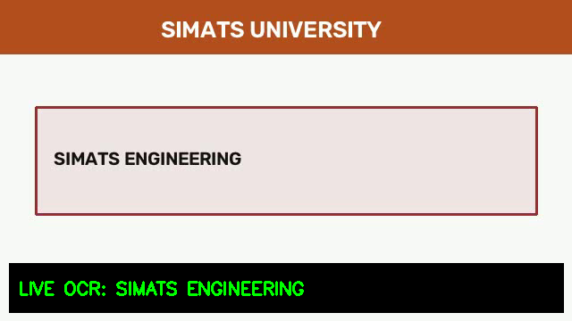 |
